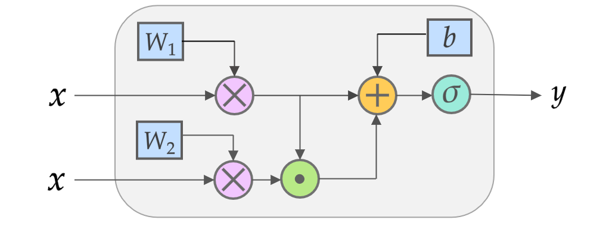

# Quadratic Residual Networks

Quadratic Residual Networks:  A New Class of Neural Networks for Solving Forward and Inverse Problems in Physics Involving PDEs

Most experiments are in ***Jupyter notebooks*** while functions and classes are defined in ***.py*** Python scripts.
