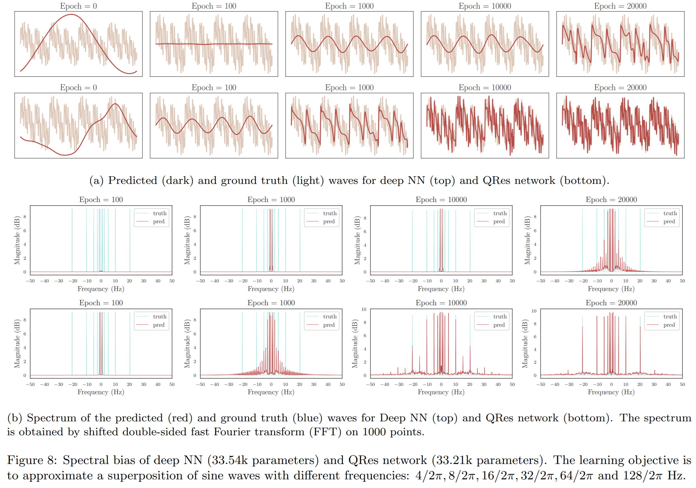
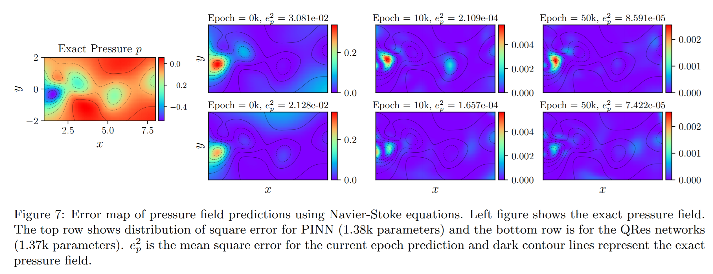

# Quadratic Residual Networks

Quadratic Residual Networks:  A New Class of Neural Networks for Solving Forward and Inverse Problems in Physics Involving PDEs

---------------------------

Most experiments are in ***Jupyter notebooks*** while functions and classes are defined in ***.py*** Python scripts.

For reference for PINN: [repo](https://github.com/maziarraissi/PINNs), [doc](https://maziarraissi.github.io/PINNs/)

General Requirements:
- Pytorch 1.5 (most experiments)
- Tensorflow v1 etc (for reproducing PINN experiments, please follow the description in [PINN](https://github.com/maziarraissi/PINNs))

---------------------------
High frequency Reponse:

Error Map of Learning Navier-Stoke Equation:

